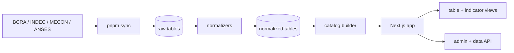

<div align="center">
  <h1>Monitorcillo</h1>
  <p><strong>Monitor macroeconómico de la Argentina, actualizado con fuentes oficiales y diseñado para leer datos rápido.</strong></p>

  <p>
    
    
    
    
    
  </p>

  <p>
    <a href="https://github.com/Fierillo/monitorcillo/actions/workflows/sync.yml">
      
    </a>
    
    <a href="./LICENSE">
      
    </a>
  </p>
</div>

---

## Qué Es

Monitorcillo consolida indicadores económicos argentinos en una interfaz compacta, cacheada y lista para consultar. Toma datos de BCRA, INDEC, MECON y otras fuentes oficiales, los normaliza con reglas propias del proyecto y publica tablas y gráficos comparables.

El objetivo no es acumular documentación paralela: el comportamiento vive en el código, los schemas y los normalizadores.

## Indicadores

| Indicador | Fuente | Vista |
| --- | --- | --- |
| Base Monetaria Amplia | BCRA e INDEC | Serie mensual normalizada contra PBI real |
| Emisión / Absorción de Pesos | BCRA y MECON | Flujo diario y acumulado |
| Recaudación tributaria | MECON | % de PBI real mensual y MM12 |
| Poder adquisitivo | INDEC, RIPTE y ANSES | Índices reales base enero 2017 |
| EMAE | INDEC | Agregado, desestacionalizado, tendencia y sectores MM12 |
| Deuda pública | MECON, BCRA e INDEC | Perfil de compromisos y deuda/PBI |

## Stack

| Capa | Tecnología |
| --- | --- |
| App | Next.js 16, React 19, TypeScript |
| UI | Tailwind CSS 4, Recharts, html-to-image |
| Datos | Neon Serverless Postgres |
| Sync | GitHub Actions, scripts Node con `tsx` |
| Calidad | ESLint, Vitest, typecheck estricto |
| Deploy | Vercel |

## Arquitectura



## Estructura

```text
src/
  app/              Next.js App Router, rutas públicas y API
  components/       Tabla principal, gráficos y vistas de indicadores
  lib/catalog/      Construcción del catálogo visible
  lib/db/           Acceso a Neon y mapeo de filas
  lib/emae/         Schema único del dominio EMAE
  lib/normalize/    Normalizadores por indicador
  lib/sync/         Jobs de sincronización y clientes externos
  types/            Contratos TypeScript compartidos
```

## Desarrollo

Requisitos:

- Node.js 22
- pnpm 10
- Base Neon compatible con `schema.sql`

Instalación:

```bash
pnpm install
cp .env.example .env
```

Variables principales:

| Variable | Uso |
| --- | --- |
| `NEON_URL` | Conexión Postgres serverless |
| `ADMIN_PASSWORD` | Acceso al panel admin |
| `SYNC_API_KEY` | Autorización para sync externo |

Comandos:

```bash
pnpm dev       # servidor local
pnpm build     # build + typecheck
pnpm lint      # eslint
pnpm test:run  # tests unitarios
pnpm sync      # sincroniza fuentes oficiales
```

## Flujo De Datos

1. `pnpm sync` descarga o consulta las fuentes oficiales.
2. Los datos crudos se guardan en tablas `*_raw`.
3. Los normalizadores generan series comparables en tablas `*_normalized`.
4. El catálogo calcula último dato, referencia, tendencia y fuente.
5. Next.js entrega la home cacheada y revalida cada 6 horas.

## Principios

- Una fuente de verdad por dominio.
- Normalizadores pequeños y auditables.
- Tipos derivados de estructuras reales, no strings duplicados.
- Documentación mínima: si algo cambia, debe cambiar el código.
- Deploy reproducible con `pnpm run build`.

## Deploy

El proyecto está preparado para Vercel. La sincronización automática corre con GitHub Actions cada 6 horas y requiere `NEON_URL` configurado como secret del repositorio.

Antes de publicar:

```bash
pnpm run build
```
